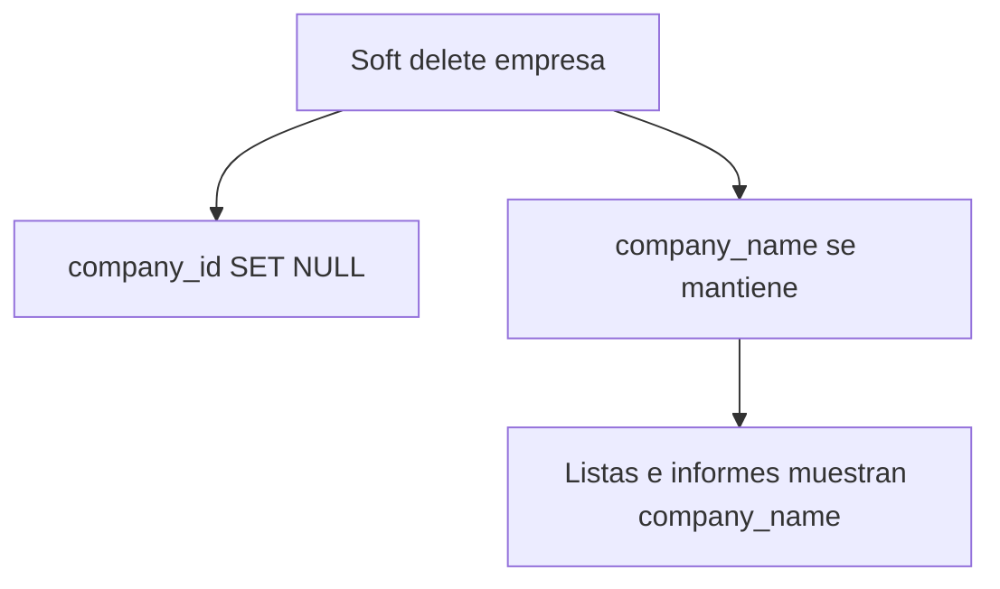
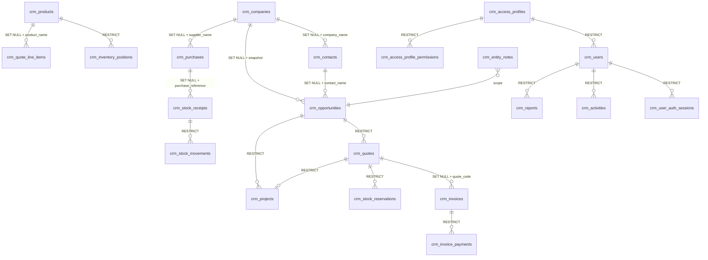

# Kora CRM — Diseño de base de datos

> Documento generado a partir del inventario del frontend (`frontend/src`).  
> Estado de la app: **demo con mocks + localStorage**; este diseño define el modelo objetivo para backend/BD relacional.

**Versión:** 3.0 · **Fecha:** mayo 2026 · **Revisión:** 3 (PostgreSQL baseline + snapshots)

### Cambios respecto a v2.0

| Área | Actualización |
|------|----------------|
| **Integridad referencial** | Sin `ON DELETE CASCADE`; FK con `RESTRICT` o `SET NULL` + columnas snapshot |
| **Snapshots** | Cada relación humana persiste `*_name` aunque se elimine el maestro (§2.6) |
| **PostgreSQL** | Script maestro [`database/postgres/kora_crm_full_install.sql`](../database/postgres/kora_crm_full_install.sql) |
| **Respaldo** | Scripts `backup_create.sh` / `backup_restore.sh` en [`database/postgres/`](../database/postgres/) |
| **Reportes** | Metadatos exponen un solo campo por relación (ej. `company_name` = «Empresa») |

### Cambios respecto a v1.0

| Área | Actualización |
|------|----------------|
| **Autenticación** | Login (`/login`), sesión en localStorage, `RequireAuth`, usuario conectado vía `AuthProvider` |
| **Perfiles** | Matriz de permisos por `MenuModuleId` (16 módulos); gobierno de menú y rutas |
| **Reportes** | 11 fuentes de datos, campos de auditoría, tipos de campo para filtros, join opcional (máx. 1) |
| **Menú** | Compras, Ingresos e Inventario en barra principal; **sin** Campos personalizados ni Integraciones |
| **Usuarios** | `profileId`, formulario ampliado (avatar, 2FA, equipos); permisos por perfil (legacy por rol deprecado) |

---

## Tabla de contenidos

1. [Resumen ejecutivo](#1-resumen-ejecutivo)
2. [Principios de diseño](#2-principios-de-diseño)
   - [2.6 Integridad referencial y snapshots](#26-integridad-referencial-y-snapshots)
3. [Revisión funcional por menú](#3-revisión-funcional-por-menú)
   - [3.0 Autenticación y sesión](#30-autenticación-y-sesión)
   - [3.17 Módulos retirados](#317-módulos-retirados-del-producto)
4. [Modelo de datos — vista general](#4-modelo-de-datos--vista-general)
5. [Esquema relacional (tablas)](#5-esquema-relacional-tablas)
6. [Enumeraciones y catálogos](#6-enumeraciones-y-catálogos)
7. [Persistencia actual (localStorage)](#7-persistencia-actual-localstorage)
8. [Migración y decisiones pendientes](#8-migración-y-decisiones-pendientes)

---

## 1. Resumen ejecutivo

Kora CRM es una aplicación comercial integral con **16 módulos de permisos** (`MenuModuleId` en `lib/menu-modules.ts`), reflejados en el sidebar como **15 entradas navegables** + Dashboard. La app exige **sesión activa** para todo excepto `/login`.

| Dominio | Módulos (`moduleId`) |
|---------|----------------------|
| **CRM comercial** | contactos, empresas, oportunidades, cotizaciones, actividades |
| **Facturación y cobros** | facturacion |
| **Operaciones / entrega** | proyectos, compras |
| **Inventario** | productos, inventario, ingresos, motor de stock |
| **Inteligencia** | reportes (tablas dinámicas, NPS) |
| **Plataforma** | usuarios, perfiles, configuracion |
| **Resumen** | dashboard |

**Autenticación (demo):** correo + contraseña única demo (`kora123`); solo usuarios con `status = Activo` en seed. La autorización de menú y CRUD la resuelve el **perfil de acceso** asignado (`profile_id`), no la matriz legacy `permissions[]` por rol en ficha de usuario.

**Entidades transversales:** notas con menciones, archivos adjuntos, historial de etapas (journeys), auditoría de registros (también expuesta en motor de reportes), vistas recientes, archivado.

**Fuera de alcance actual (eliminados del menú):** Campos personalizados, Integraciones — ver [§3.17](#317-módulos-retirados-del-producto).

**Implementación PostgreSQL:** ver [`database/README.md`](../database/README.md) y script [`kora_crm_full_install.sql`](../database/postgres/kora_crm_full_install.sql).

---

## 2. Principios de diseño

### 2.1 Convenciones

| Regla | Detalle |
|-------|---------|
| Prefijo tablas | `crm_` |
| Claves primarias | `UUID` (reemplazar ids demo: `c1`, `op3`, `u1`, etc.) |
| Montos | `BIGINT` en centavos (`amount_cents`); la UI usa strings formateados |
| Fechas de negocio | `DATE` o `TIMESTAMPTZ` según contexto |
| Auditoría | En todas las tablas de negocio principales (ver §2.2) |
| Soft delete | `deleted_at` + `deleted_by_id` en maestros; `archived_at` donde aplique papelera en UI |
| Integridad FK | **Nunca** `ON DELETE CASCADE` (ver §2.6) |
| Snapshots | Columna `*_name` junto a cada FK de relación humana |
| Multi-tenant | Reservar `tenant_id` si el producto escala a SaaS (no en demo actual) |

### 2.2 Campos de auditoría (`RecordAuditFields`)

Presentes en casi todas las entidades de lista del CRM:

```sql
created_at      TIMESTAMPTZ NOT NULL DEFAULT now(),
created_by_id   UUID REFERENCES crm_users(id),
created_by_name VARCHAR(255),  -- denormalizado para histórico
updated_at      TIMESTAMPTZ NOT NULL DEFAULT now(),
updated_by_id   UUID REFERENCES crm_users(id),
updated_by_name VARCHAR(255)
```

### 2.3 Relaciones polimórficas

La app usa varios vínculos polimórficos que en BD pueden modelarse como:

- **Opción A:** `related_type` + `related_id` (como actividades, notas, archivos).
- **Opción B:** Tablas puente específicas cuando la cardinalidad es fija (recomendado para FKs e integridad).

Este documento indica ambos donde aplica.

### 2.4 Journeys (etapas / kanban)

Módulos con flujo por etapas persisten overrides en localStorage (`kora-crm-{entity}-journey`). En BD:

```sql
crm_entity_journey_states (
  entity_type   VARCHAR NOT NULL,  -- opportunity, quote, invoice, purchase, project, activity
  entity_id     UUID NOT NULL,
  current_stage VARCHAR NOT NULL,
  is_off_route  BOOLEAN DEFAULT false,
  updated_at    TIMESTAMPTZ,
  PRIMARY KEY (entity_type, entity_id)
)

crm_entity_stage_history (
  id            UUID PRIMARY KEY,
  entity_type   VARCHAR NOT NULL,
  entity_id     UUID NOT NULL,
  stage         VARCHAR NOT NULL,
  entered_at    TIMESTAMPTZ NOT NULL,
  note          TEXT,
  paused_from_main BOOLEAN,
  changed_by_id UUID
)
```

### 2.5 Autorización (perfiles de acceso)

Flujo en la app demo:

1. **Autenticación** — identifica `user_id` (§3.0).
2. **Perfil** — `crm_users.profile_id` → matriz en `crm_access_profile_permissions`.
3. **Ruta** — `pathToModuleId(pathname)` obtiene `module_id`; `RouteAccessGuard` exige `can_view`.
4. **Menú** — sidebar filtra ítems con `can_menu`.
5. **Acciones UI** — botones crear/editar/eliminar deben respetar flags (parcial en demo; completo en backend).

No persistir permisos efectivos por usuario salvo el FK al perfil; cambiar un perfil actualiza a todos sus usuarios.

### 2.6 Integridad referencial y snapshots

Principio **referencia + snapshot**: el hijo guarda la FK al maestro **y** el nombre legible congelado al vincular. Si el maestro se elimina o archiva, el hijo conserva historia.



| Regla | Postgres |
|-------|----------|
| Prohibido CASCADE | Todas las FK: `ON DELETE RESTRICT` o `ON DELETE SET NULL`; **cero** `ON DELETE CASCADE` |
| Snapshot obligatorio | Columna `*_name` / `*_label` rellenada al insertar/actualizar FK; **no se vacía** si FK pasa a NULL |
| Borrado de maestros | Preferir `deleted_at` en empresas, contactos, productos, usuarios; hard delete solo sin referencias RESTRICT |
| UI / reportes | Leer snapshot; FK solo para navegación si el registro existe |
| Triggers | `BEFORE INSERT OR UPDATE OF fk` copia nombre desde maestro (implementado en SQL) |

**Convención TS ↔ BD:**

| App (TS) | Columna BD |
|----------|------------|
| `company` | `company_name` |
| `contactName` | `contact_name` |
| `supplier` | `supplier_name` |
| `relatedName` | `related_name` |

#### Matriz de snapshots por entidad

| Tabla hija | FK | Columnas snapshot |
|------------|-----|-------------------|
| `crm_contacts` | `company_id` | `company_name` |
| `crm_opportunities` | `company_id`, `contact_id` | `company_name`, `contact_name` |
| `crm_quotes` | `opportunity_id`, `company_id`, `contact_id` | `opportunity_name`, `company_name`, `contact_name`, `code` |
| `crm_quote_line_items` | `product_id` | `product_name`, `sku` |
| `crm_invoices` | `quote_id`, `company_id`, `contact_id` | `quote_code`, `company_name`, `contact_name`, `client_name` |
| `crm_invoice_line_items` | `product_id` | `product_name`, `sku` |
| `crm_activities` | polimórfico | `related_name`, `company_name` |
| `crm_projects` | `company_id`, `opportunity_id`, `accepted_quote_id` | `client_name`, `opportunity_name`, `quote_code` |
| `crm_purchases` | `supplier_id` | `supplier_name` |
| `crm_purchase_line_items` | `product_id` | `product_name`, `sku` |
| `crm_stock_receipts` | `purchase_id` | `purchase_reference`, `supplier_name`, `warehouse_name` |
| `crm_stock_receipt_lines` | `product_id` | `product_name`, `sku` |
| `crm_stock_movements` | `product_id` | `product_name`, `sku`, `reference` |
| `crm_stock_reservations` | `product_id`, `quote_id`, `invoice_id` | `product_name`, `sku`, refs documento |
| `crm_inventory_positions` | `product_id`, `warehouse_id` | `product_name`, `warehouse_name`, `sku` |
| Polimórficos (notas, archivos) | `entity_id` | `entity_label_snapshot` |
| Auditoría (todas) | `created_by_id`, `updated_by_id` | `created_by_name`, `updated_by_name` |

Ejemplo contacto:

```sql
company_id   UUID REFERENCES crm_companies(id) ON DELETE SET NULL,
company_name VARCHAR(255) NOT NULL DEFAULT '',
```

---

## 3. Revisión funcional por menú

### 3.0 Autenticación y sesión

| Aspecto | Detalle |
|---------|---------|
| **Ruta pública** | `/login` → `LoginPage` |
| **Protección** | `RequireAuth` envuelve `AppShell`; rutas internas redirigen a login si no hay sesión |
| **Contexto** | `AuthProvider` (`contexts/auth.tsx`): `login`, `logout`, `session` |
| **Validación** | `authenticateUser` (`lib/auth.ts`): email normalizado, password demo, usuario en `userListSeed`, estado Activo |
| **Usuario UI** | `getCurrentUser()` / `useAuth()` — reemplaza uso estático de `CURRENT_USER` donde aplique |
| **TopBar** | Menú avatar: «Mi perfil» → `/usuarios/:id`, «Cerrar sesión» → limpia sesión y navega a `/login` |
| **Storage** | `kora-auth-session` (`AuthSession`: `userId`, `email`, `name`) |

**Modelo BD objetivo:**

```sql
crm_users (
  ...
  password_hash VARCHAR,     -- bcrypt/argon2; NO almacenar demo plano
  status user_status NOT NULL,
  profile_id UUID REFERENCES crm_access_profiles(id),
  last_login_at TIMESTAMPTZ
)

-- Sesión servidor (reemplaza localStorage en producción)
crm_user_auth_sessions (
  id UUID PRIMARY KEY,
  user_id UUID NOT NULL REFERENCES crm_users(id),
  token_hash VARCHAR NOT NULL,
  expires_at TIMESTAMPTZ NOT NULL,
  created_at TIMESTAMPTZ DEFAULT now(),
  user_agent TEXT,
  ip_address INET
)
```

**API sugerida:** `POST /api/v1/auth/login`, `POST /api/v1/auth/logout`, `GET /api/v1/auth/me` — JWT o cookie httpOnly; middleware carga `user_id` + resuelve permisos desde `crm_access_profile_permissions`.

**Nota:** `crm_user_sessions` (§5.4) modela el historial «dispositivo / ubicación» de la ficha de usuario, distinto de la sesión de autenticación activa.

---

### 3.1 Dashboard (`/`)

| Aspecto | Detalle |
|---------|---------|
| **Rutas** | `/` → `DashboardPage` |
| **Persistencia** | Ninguna; datos en `data/dashboard.mock.ts` |
| **Funcionalidad** | KPIs, embudo de ventas, gráfico ingresos vs gastos, actividades pendientes, oportunidades recientes, tareas por proyecto, selector de rango de fechas |
| **BD sugerida** | Vistas materializadas o consultas agregadas sobre `crm_opportunities`, `crm_activities`, `crm_invoices`, `crm_projects` — no tablas propias |

---

### 3.2 Contactos (`/contactos`)

| Aspecto | Detalle |
|---------|---------|
| **Rutas** | Lista `/contactos`, detalle `/contactos/:contactId` |
| **Tabs detalle** | `detalle`, `actividad`, `emails`, `notas`, `oportunidades`, `archivos` |
| **Vistas lista** | Lista, Kanban (por `status`), Segmentos, Archivados |
| **Alcance** | `mine` / `all` / `recent` |
| **CRUD** | `ContactsRegistryProvider` — alta, edición, archivar, restaurar, eliminar permanente, importación masiva |
| **Storage** | `kora-crm-user-contacts`, `kora-crm-contact-details`, `kora-crm-archived-contacts`, `kora-contact-files-{id}`, `kora-crm-recent-contactos` |

**Entidad principal:** `ContactListItem` / `ContactDetail`

| Campo (app) | Columna BD | Tipo | Notas |
|-------------|------------|------|-------|
| `id` | `id` | UUID PK | |
| `name` | `name` | VARCHAR | |
| `subtitle` | `subtitle` | VARCHAR | |
| `avatarUrl` | `avatar_url` | TEXT | |
| `companyId` | `company_id` | UUID FK → `crm_companies` | `ON DELETE SET NULL` |
| `company` | `company_name` | VARCHAR NOT NULL | **Snapshot** §2.6; persiste si empresa se elimina |
| `email` | `email` | VARCHAR | INDEX |
| `phone` | `phone` | VARCHAR | |
| `mobilePhone` | `mobile_phone` | VARCHAR | |
| `role` | `job_title_contact` | VARCHAR | cargo del contacto |
| `status` | `status` | ENUM | Lead, Prospecto, Cliente, Proveedor |
| `rut` | `rut` | VARCHAR | validación CL |
| `streetAddress` | `street_address` | TEXT | |
| `region` | `region` | VARCHAR | |
| `commune` | `commune` | VARCHAR | |
| `linkedIn` | `linked_in` | VARCHAR | |
| `source` | `source` | VARCHAR | |
| `initialNote` | `initial_note` | TEXT | |
| `ownerName` | `owner_user_id` | UUID FK → `crm_users` | |
| `lastContactLabel` | `last_contact_at` | TIMESTAMPTZ | derivar de actividades |
| `location`, `timezone`, `score`, `pipelineValue`, `tags` | columnas / `crm_contact_tags` | | detalle |
| `activities`, `opportunities` | tablas hijas / joins | | no duplicar en contacto |

**Relaciones:** → Empresas (`company_id`); ← Oportunidades (`contact_id`); ← Actividades (`related_type=contacto`); emails mock; archivos por entidad.

**Segmentos:** definidos en `data/contacts-views.mock.ts` (filtros fijos, no persistidos) → candidato `crm_saved_segments`.

---

### 3.3 Empresas (`/empresas`)

| Aspecto | Detalle |
|---------|---------|
| **Rutas** | `/empresas`, `/empresas/:companyId` |
| **Tabs** | `detalle`, `actividad`, `ubicacion`, `notas`, `oportunidades`, `contactos`, `archivos` |
| **Vistas** | Lista, Kanban (`lifecycle`), Segmentos, Archivados |
| **CRUD** | `CompaniesRegistryProvider` |
| **Storage** | `kora-crm-user-companies`, `kora-crm-company-details`, `kora-crm-archived-companies`, `kora-company-files-{id}` |

**Entidad:** `CompanyListItem` / `CompanyDetail`

| Campo | Columna BD | FK / notas |
|-------|------------|------------|
| `name`, `logoUrl`, `rut` | `name`, `logo_url`, `rut` | `rut` UNIQUE |
| `industry`, `city`, `employees` | idem | |
| `owner` | `owner_user_id` | → users |
| `lifecycle` | `lifecycle` | ENUM Lead/Prospecto/Cliente/Proveedor |
| `operationalStatus` | `operational_status` | Activa/Inactiva |
| `headquarters`, `branches[]`, `addresses[]` | `crm_company_addresses`, `crm_company_branches` | normalizar |
| `linkedContacts[]` | inverso `crm_contacts.company_id` | |
| `website`, `phone`, `email`, `description` | columnas detalle | |

**Relaciones:** ← Contactos, ← Oportunidades, ← Compras (`supplier_id` como proveedor).

---

### 3.4 Oportunidades (`/oportunidades`)

| Aspecto | Detalle |
|---------|---------|
| **Rutas** | `/oportunidades`, `/oportunidades/:opportunityId` |
| **Tabs** | `detalle`, `actividad`, `cotizaciones`, `notas`, `archivos` |
| **Vistas** | Lista, Kanban (journey), Segmentos, Archivados |
| **Journey** | Main: Calificados → En diagnóstico → Propuesta → Negociación → Cerrada; off-route: En espera cliente, Pausada, Perdida, No calificada |
| **Storage journey** | `kora-crm-opportunity-journey` |
| **CRUD** | `OpportunitiesRegistryProvider` |

**Entidad:** `OpportunityListItem` / `OpportunityDetail`

| Campo | Columna BD |
|-------|------------|
| `name` | `name` |
| `customerKind` | `customer_kind` ENUM contacto/empresa |
| `companyId`, `contactId` | FKs nullable |
| `amount`, `weightedAmount` | `amount_cents`, `weighted_amount_cents` |
| `stage`, `probability`, `closeDate` | `stage`, `probability_pct`, `close_date` |
| `type`, `priority`, `outcome`, `forecast`, `source` | ENUMs / VARCHAR |
| `lineItems[]` | `crm_opportunity_line_items` |
| `stageHistory[]` | `crm_entity_stage_history` |
| `quotes[]` | `crm_quotes.opportunity_id` |

**Relaciones:** → Contacto/Empresa; → Cotizaciones (1:N); → Proyectos (`opportunity_id`).

---

### 3.5 Cotizaciones (`/cotizaciones`)

| Aspecto | Detalle |
|---------|---------|
| **Rutas** | `/cotizaciones`, `/cotizaciones/:quoteId` |
| **Tabs** | `detalle`, `actividad`, `facturas`, `historial`, `notas`, `archivos` |
| **Journey** | Borrador → En revisión → Enviada → En negociación → Aceptada (+ off-route) |
| **Storage** | `kora-crm-user-quotes`, `kora-crm-quote-details`, `kora-crm-quote-journey`, `kora-crm-archived-quotes` |
| **Integración stock** | Reserva inventario al avanzar estados (`stock-service`) |

**Entidad:** `QuoteListItem` / `QuoteDetail`

| Campo | Columna BD |
|-------|------------|
| `code` | `code` UNIQUE |
| `title` | `title` |
| `opportunityId` | `opportunity_id` NOT NULL FK |
| `contactId`, `companyId` | FKs |
| `amount` | `amount_cents` |
| `status` | `status` (journey stage) |
| `validUntil`, `issueDate` | `valid_until`, `issue_date` |
| `currency`, `subtotal`, `discountPercent`, `taxPercent`, etc. | columnas monetarias |
| `destinationWarehouseId` | FK → `crm_warehouses` |
| `lineItems[]` | `crm_quote_line_items` (`product_id`, `sku`, qty, precios) |
| `statusHistory[]` | historial journey |

**Relaciones:** → Oportunidad; → Facturas (`quote_id`); → Reservas stock (`quote_id`, `quote_line_id`).

---

### 3.6 Facturación (`/facturacion`)

| Aspecto | Detalle |
|---------|---------|
| **Rutas** | `/facturacion`, `/facturacion/:invoiceId` |
| **Tabs** | `detalle`, `actividad`, `archivos`, `notas` |
| **Journey** | Borrador → Pendiente → Pagada (+ Vencida, Anulada) |
| **CRUD** | `InvoicesRegistryProvider`; crear desde cotización o directa |
| **Features** | Pagos parciales, `siiNumber`, PDF con datos de organización |

**Entidad:** `InvoiceListItem` / `InvoiceDetail`

| Campo | Columna BD |
|-------|------------|
| `number` | `number` UNIQUE |
| `quoteId` | `quote_id` nullable FK |
| `contactId`, `companyId`, `customerKind` | FKs + ENUM |
| `amount`, `balanceDue`, `paidAmountNum` | centavos |
| `issueDate`, `dueDate` | DATE |
| `status` | journey |
| `paymentMethod`, `siiNumber` | VARCHAR |
| `lineItems[]` | `crm_invoice_line_items` (+ `subject_to_vat`) |
| `payments[]` | `crm_invoice_payments` |
| `taxableSubtotal`, `exemptSubtotal` | centavos |

---

### 3.7 Actividades (`/actividades`)

| Aspecto | Detalle |
|---------|---------|
| **Rutas** | `/actividades`, `/actividades/:activityId` |
| **Tabs** | `detalle`, `historial`, `notas`, `archivos` |
| **Journey** | Pendiente → En curso → Completada (+ Vencida) |
| **CRUD** | `ActivitiesRegistryProvider`; creación global con lookup de entidad relacionada |

**Entidad:** `ActivityListItem` / `ActivityDetail`

| Campo | Columna BD |
|-------|------------|
| `title`, `type` | `title`, `type` ENUM |
| `relatedType`, `relatedId` | polimórfico INDEX compuesto |
| `due`, `scheduledAt`, `reminderAt` | TIMESTAMPTZ |
| `assignee` | `assignee_user_id` FK |
| `status`, `priority` | ENUM |
| `description`, `location`, `outcome`, `durationMinutes` | detalle |

**`ActivityRelatedType`:** contacto, empresa, oportunidad, cotizacion, compra, factura, proyecto, ingreso, producto, inventario.

**Notas:** scope `actividad` en `entity-notes-storage`.

---

### 3.8 Proyectos (`/proyectos`)

| Aspecto | Detalle |
|---------|---------|
| **Rutas** | `/proyectos`, `/proyectos/:projectId` |
| **Tabs** | `detalle`, `equipo`, `actividad`, `notas` |
| **Journey** | Nuevo → En Levantamiento → En Proceso → Entregado → Cerrado (+ stoppers) |
| **Storage extra** | `kora-crm-project-work-plans`, `kora-crm-project-relations` |

**Entidad:** `ProjectListItem` / `ProjectDetail`

| Campo | Columna BD |
|-------|------------|
| `name`, `client` | `name`, `client_label` |
| `companyId`, `opportunityId`, `acceptedQuoteId` | FKs (cotización aceptada misma oportunidad) |
| `progress`, `progressNum` | `progress_pct` |
| `deadline`, `startDate` | DATE |
| `manager` | `manager_user_id` |
| `journeyStage`, `status`, `priority`, `health` | ENUMs |
| `budget`, `hoursLogged`, `hoursEstimated` | centavos / DECIMAL |
| `team[]` | `crm_project_team_members` |
| Plan de trabajo | `crm_project_work_groups`, `crm_project_work_items` |

**Work plan** (`ProjectWorkPlan`): grupos con `accent`, `order`, `collapsed`; ítems con `parent_id` (subactividades), `assignees[]`, horas estimadas/reales, fechas.

---

### 3.9 Compras (`/compras`)

| Aspecto | Detalle |
|---------|---------|
| **Rutas** | `/compras`, `/compras/:purchaseId` |
| **Tabs** | `detalle`, `actividad`, `lineas`, `ingresos`, `inventario`, `notas`, `archivos` |
| **Journey** | Pendiente → Parcial → Recibida (+ En espera proveedor, Cancelada) |
| **Features** | PDF orden de compra, % recibido, vínculo con ingresos |

**Entidad:** `PurchaseListItem` / `PurchaseDetail`

| Campo | Columna BD |
|-------|------------|
| `reference` | `reference` UNIQUE |
| `supplierId` | FK → `crm_companies` (proveedor) |
| `supplierContactId` | FK → `crm_contacts` |
| `warehouseId` | FK → `crm_warehouses` |
| `orderDate`, `amount` | DATE, centavos |
| `stage`, `receivedPercent` | journey + SMALLINT |
| `lineItems[]` | `crm_purchase_line_items` (`quantity_received`) |

**Relaciones:** → Ingresos (`purchase_id`); → Movimientos stock.

---

### 3.10 Ingresos — Recepciones de stock (`/ingresos`)

| Aspecto | Detalle |
|---------|---------|
| **Rutas** | `/ingresos`, `/ingresos/:receiptId` |
| **Tabs** | `detalle`, `lineas`, `notas` |
| **Estados** | Borrador → Confirmado (kanban) |
| **CRUD** | `StockReceiptsRegistryProvider`; `confirmReceipt` actualiza stock y compra |

**Entidad:** `StockReceiptListItem` / `StockReceiptDetail`

| Campo | Columna BD |
|-------|------------|
| `number` | `number` UNIQUE |
| `status` | ENUM Borrador/Confirmado |
| `purchaseId` | FK nullable (modo vinculado a OC vs standalone) |
| `warehouseId` | FK |
| `externalReference` | VARCHAR |
| `lineItems[]` | `crm_stock_receipt_lines` |
| `confirmedAt` | TIMESTAMPTZ |

Al confirmar: escribe en `crm_stock_movements` y actualiza posiciones de inventario.

---

### 3.11 Inventario (`/inventario`)

| Aspecto | Detalle |
|---------|---------|
| **Rutas** | `/inventario`, `/inventario/:inventoryId` |
| **Tabs** | `detalle`, `bodegas`, `actividad`, `movimientos`, `compras`, `productos`, `notas`, `archivos` |
| **CRUD** | Solo **actualización** en registry; posiciones derivadas del motor de stock |
| **Storage** | `kora-crm-user-inventory`, `kora-crm-stock-ledger` |

**Entidad:** `InventoryListItem` / `InventoryDetail` — una fila por **SKU + ubicación/bodega**

| Campo | Columna BD |
|-------|------------|
| `sku`, `productName` | `sku`, denorm `product_name` |
| `location` / bodega | `warehouse_id` FK |
| `quantityNum`, `reservedQtyNum`, `availableQtyNum` | INT (materializado o calculado) |
| `minStockNum`, `status` | umbral + ENUM calculado |
| `movements[]` | `crm_stock_movements` |

**Status derivados:** En tránsito, En stock, Stock bajo, Quiebre, Sin stock, Reservado.

---

### 3.12 Productos (`/productos`)

| Aspecto | Detalle |
|---------|---------|
| **Rutas** | `/productos`, `/productos/:productId` |
| **Tabs** | `detalle`, `actividad`, `inventario`, `ingresos`, `compras`, `facturas`, `notas` |
| **CRUD** | `ProductsRegistryProvider`; sync con inventario (`product-inventory-sync`) |
| **Categorías** | Desde `crm_product_categories` (settings) |

**Entidad:** `ProductListItem` / `ProductDetail`

| Campo | Columna BD |
|-------|------------|
| `name`, `sku` | `name`, `sku` UNIQUE |
| `category` | `category_id` FK |
| `productType` | ENUM Físico/Servicio/Licencia/… |
| `unitOfMeasure`, `customUnit` | VARCHAR |
| `priceNum`, `costPriceNum` | centavos |
| `stockNum` | INT (-1 = no aplica) |
| `status` | Activo/Agotado/Borrador |
| `trackInventory`, `minStock`, `maxStock` | BOOLEAN, INT |
| `dimensions`, `weight`, `taxRate`, `billingPeriod` | detalle catálogo |
| `barcode`, `imageUrl` | VARCHAR, TEXT |

Referenciado en líneas de cotización, factura, compra, ingreso y reservas.

---

### 3.13 Reportes (`/reportes`)

| Aspecto | Detalle |
|---------|---------|
| **Rutas** | `/reportes` → `ReportsPage` / `ReportsFinder` |
| **UI** | Árbol de carpetas (toggle «Árbol», oculto por defecto), panel de configuración y ejecución, scroll vertical en panel principal |
| **Tipos informe** | `dashboard` (NPS clientes), `table` (tabla dinámica — default) |
| **Storage** | `kora-crm-reports-tree`, `kora-crm-reports-expanded` |
| **Export** | Excel (`xlsx`) desde resultado ejecutado |

#### Fuentes de datos (`ReportDataSourceId`)

| `dataSource` | Seed / origen filas | Joins disponibles (`joinId`) |
|--------------|---------------------|------------------------------|
| `contactos` | `contactListSeed` | `contactos->empresas` (por `companyId` → empresa) |
| `empresas` | `companyListSeed` | — |
| `oportunidades` | `opportunityListSeed` | `oportunidades->empresas` |
| `actividades` | `activityListSeed` | — |
| `productos` | `productListSeed` | — |
| `facturas` | `invoiceListSeed` | `facturas->cotizaciones` (por `quoteId`) |
| `proyectos` | `projectListSeed` | — |
| `cotizaciones` | `quoteListSeed` | — |
| `compras` | `purchaseListSeed` | `compras->empresas` (proveedor por `supplierId`) |
| `ingresos` | `stockReceiptListSeed` | `ingresos->compras` (por `purchaseId`) |
| `inventario` | `inventoryListSeed` | — |

Regla de join: **máximo una relación** por informe. Las columnas del relacionado se prefijan (`empresa.nombre`, `proveedor.rut`, etc.) vía `applyJoin` en `lib/report-data-sources.ts`.

#### Campos y tipos (`ReportFieldDef`)

Cada fuente expone **todos los campos** del listado seed más columnas de auditoría unificadas:

| Campo reporte | Origen entidad | `type` |
|---------------|----------------|--------|
| `createdByName` | `createdByName` | text |
| `createdAtDate` | `createdAt` (ISO date) | date |
| `updatedByName` | `updatedByName` | text |
| `updatedAtDate` | `updatedAt` (ISO date) | date |
| Resto | propiedades del list item | `text`, `number`, `date`, `picklist`, `lookup`, `boolean` (inferido por `guessFieldType`) |

Los filtros (`ReportFilterBuilder`) adaptan el control UI al `type` (número, fecha, select con `options`, booleano).

#### Configuración persistida (`ReportTableConfig` → JSONB)

```typescript
{
  dataSource: ReportDataSourceId
  joinId?: string                    // opcional; ver tabla joins arriba
  columnIds: string[]                // orden de columnas visibles
  conditions: ReportFilterCondition[]  // fieldId, operator, value
  combineMode: 'all-and' | 'any-or' | 'custom'
  customExpression: string           // ej. "1 Y 2 O ((3 Y 4) O 5)"
}
```

Operadores: `equals`, `not_equals`, `contains`, `not_contains`, `greater`, `less`, `is_empty`, `is_not_empty`.

**Ejecución:** `runReportTable` materializa filas en memoria desde seeds + join; `report-filter-engine` aplica condiciones. En BD real, equivalente a **vista SQL dinámica** o query builder con `JOIN` explícito según `joinId` almacenado.

**Entidades:**

```sql
crm_report_folders (id, name, parent_id, sort_order, ...)
crm_reports (
  id, folder_id, name, report_type, author_user_id,
  schedule, description, template_id,
  table_config JSONB,  -- ReportTableConfig: dataSource, joinId, columnIds, conditions, ...
  last_run_at, ...
)
crm_report_runs (id, report_id → crm_reports **ON DELETE CASCADE**, run_at, result_meta JSONB)  -- histórico ejecuciones
```

**Metadatos de columnas:** en vistas/reportes exponer solo el snapshot con etiqueta legible (ej. `company_name` → «Empresa»); ocultar `company_id` en filtros de usuario final (ver `report-data-sources.ts`).

---

### 3.14 Usuarios (`/usuarios`)

| Aspecto | Detalle |
|---------|---------|
| **Rutas** | `/usuarios`, `/usuarios/:userId` |
| **Tabs** | `detalle`, `permisos` (lectura del perfil asignado), `notas` |
| **CRUD** | Invitar (`InviteUserDialog`), editar (`EditUserDialog` + `UserFormFields` con avatar) |
| **Registry** | `UsersRegistryProvider` — alta persiste override completo vía `userDetailToOverride` |
| **Storage** | `kora-crm-user-users`, `kora-crm-user-detail-{userId}` |
| **Login** | Solo usuarios `Activo` con email del seed; ver [§3.0](#30-autenticación-y-sesión) |

**Entidad:** `UserListItem` / `UserDetail`

| Campo | Columna BD |
|-------|------------|
| `name`, `email` | `name`, `email` UNIQUE |
| `role` | `role` VARCHAR — **legacy UI**; no sustituye al perfil de acceso |
| `profileId` | `profile_id` FK → `crm_access_profiles` NOT NULL (en producción) |
| `status` | ENUM Activo/Invitado/Inactivo |
| `avatarUrl`, `phone`, `department`, `jobTitle` | perfil usuario |
| `timezone`, `language`, `twoFactorEnabled`, `bio` | preferencias |
| `teams[]` | `crm_user_team_members` o JSONB |
| `recentSessions[]` | `crm_user_sessions` (histórico, no auth activa) |
| `permissions[]` | **deprecar** — matriz `UserPermissionModule` por rol; fuente de verdad: perfil |

**Formulario compartido** (`lib/user-form.ts`): validación, `applyFormValuesToUser`, campos `profileId`, `twoFactorEnabled` en override de detalle.

---

### 3.15 Perfiles (`/perfiles`)

| Aspecto | Detalle |
|---------|---------|
| **Rutas** | `/perfiles`, `/perfiles/:profileId` |
| **UI** | Lista, detalle, `ProfilePermissionsEditor` (tabla módulo × acciones) |
| **CRUD** | Crear, editar nombre/descripción/permisos, eliminar (perfiles no `isSystem`) |
| **Storage** | `kora-profiles-registry-v1` (prefijo histórico `kora-`; unificar en migración) |
| **Control acceso** | `AccessControlProvider`, `RouteAccessGuard`, sidebar filtrado por `can_menu` |
| **Seeds** | Perfiles sistema (ej. administrador con permisos completos) |

**Módulos en matriz** (`MENU_MODULE_DEFINITIONS` — 16 filas):

`dashboard`, `contactos`, `empresas`, `oportunidades`, `cotizaciones`, `facturacion`, `actividades`, `proyectos`, `compras`, `ingresos`, `inventario`, `productos`, `reportes`, `usuarios`, `perfiles`, `configuracion`.

**Acciones por módulo** (`PermissionAction`):

| Flag BD | Etiqueta UI |
|---------|-------------|
| `can_menu` | Ver menú |
| `can_view` | Visualización |
| `can_create` | Creación |
| `can_edit` | Edición |
| `can_delete` | Eliminación |

```sql
crm_access_profiles (
  id UUID PK,
  name VARCHAR NOT NULL,
  description TEXT,
  is_system BOOLEAN DEFAULT false,
  user_count INT,              -- materializado o COUNT en consulta
  updated_at TIMESTAMPTZ
)

crm_access_profile_permissions (
  profile_id UUID FK,
  module_id VARCHAR NOT NULL,  -- MenuModuleId
  can_menu BOOLEAN NOT NULL DEFAULT false,
  can_view BOOLEAN NOT NULL DEFAULT false,
  can_create BOOLEAN NOT NULL DEFAULT false,
  can_edit BOOLEAN NOT NULL DEFAULT false,
  can_delete BOOLEAN NOT NULL DEFAULT false,
  PRIMARY KEY (profile_id, module_id)
)
```

Resolución en runtime: `session.userId` → `crm_users.profile_id` → filas en `crm_access_profile_permissions`. Rutas sin `can_view` redirigen o muestran acceso denegado.

---

### 3.16 Configuración (`/configuracion`)

| Sección | Estado UI | Tabla BD |
|---------|-----------|----------|
| `empresa` | Activo | `crm_organization_settings` (singleton por tenant) |
| `bodegas` | Activo | `crm_warehouses` |
| `categorias` | Activo | `crm_product_categories` |
| `impuestos` | Próximamente | `crm_tax_settings` |
| `usuarios` | Próximamente | redirige a módulo Usuarios |

**OrganizationSettings:** `legalName`, `tradeName`, `tagline`, `rut`, `giro`, `address`, `city`, `phone`, `email`, `logoUrl`, `defaultVatPercent`.

**WarehouseSetting:** `id`, `name`, `code`, `address`, `isDefault`, `active`.

**ProductCategorySetting:** `id`, `name`, `active`.

Storage: `kora-crm-organization-settings`, `kora-crm-catalog-settings`.

> Las subsecciones «Campos personalizados» e «Integraciones» **no existen** en la app actual; antes eran placeholders en configuración.

---

### 3.17 Módulos retirados del producto

| Módulo (histórico) | Estado | Impacto BD |
|--------------------|--------|------------|
| **Campos personalizados** | Eliminado del menú y código (`config/list-modules/custom-fields.ts`, rutas, storage) | No crear `crm_custom_fields` hasta nuevo requerimiento |
| **Integraciones** | Eliminado (`integrations.ts`, menú) | No crear `crm_integrations` en fase actual |

Si se reintroducen, modelar como extensiones de esquema (`crm_entity_custom_field_definitions`, `crm_entity_custom_values`, `crm_integration_connections`) con `module_id` y permisos en perfiles dedicados.

---

## 4. Modelo de datos — vista general



> **Política:** ninguna relación usa `ON DELETE CASCADE`. Ver §2.6 y [`kora_crm_full_install.sql`](../database/postgres/kora_crm_full_install.sql).

---

## 5. Esquema relacional (tablas)

### 5.1 Núcleo CRM

#### `crm_contacts`
Ver §3.2. Índices: `(company_id)`, `(status)`, `(owner_user_id)`, `(email)`, `(rut)`.

#### `crm_companies`
Ver §3.3. Índices: `(lifecycle)`, `(operational_status)`, `(rut)`.

#### `crm_company_addresses`
`id`, `company_id`, `label`, `street`, `city`, `commune`, `region`, `country`, `postal_code`, `lat`, `lng`, `is_headquarters`, `phone`.

#### `crm_company_branches`
`id`, `company_id`, `name`, `address` (JSON o columnas), `phone`, `manager_name`.

#### `crm_opportunities`
Ver §3.4.

#### `crm_opportunity_line_items`
`id`, `opportunity_id`, `description`, `product_name`, `quantity`, `unit_price_cents`, `discount_pct`, `total_cents`, `sort_order`.

#### `crm_quotes` / `crm_quote_line_items`
Ver §3.5.

#### `crm_invoices` / `crm_invoice_line_items` / `crm_invoice_payments`
Ver §3.6.

#### `crm_activities`
Ver §3.7. Índice: `(related_type, related_id)`, `(assignee_user_id)`, `(status)`, `(due_at)`.

#### `crm_projects` / `crm_project_team_members`
Ver §3.8. Team: `project_id`, `user_id`, `role_label`.

#### `crm_project_work_groups` / `crm_project_work_items`
Ver tipos `ProjectWorkPlan`.

---

### 5.2 Compras e inventario

#### `crm_purchases` / `crm_purchase_line_items`
Ver §3.9.

#### `crm_stock_receipts` / `crm_stock_receipt_lines`
Ver §3.10.

#### `crm_products`
Ver §3.12.

#### `crm_inventory_positions`
`id`, `product_id`, `sku`, `warehouse_id`, `quantity_on_hand`, `quantity_reserved`, `quantity_available`, `min_stock`, `status`, `last_movement_at`.  
**UNIQUE** `(sku, warehouse_id)`.

#### `crm_stock_movements`
`id`, `inventory_position_id`, `movement_type`, `reference`, `quantity_delta`, `reserved_delta`, `occurred_at`, `author_user_id`, `source_kind`, `source_id`, `adjustment_detail JSONB`.

#### `crm_stock_reservations`
`id`, `inventory_position_id`, `sku`, `product_id`, `qty`, `quote_id`, `invoice_id`, `quote_line_id`, `status`, `created_at`.  
Ver `StockReservationStatus`: active, transferred, committed, released.

#### `crm_inventory_ledger`
Ajuste acumulado por posición (`quantity_adjustment`) — puede fusionarse con `crm_inventory_positions`.

---

### 5.3 Transversales

#### `crm_entity_notes`
`id`, `scope` (oportunidad|cotizacion|factura|actividad|proyecto|usuario|contacto|empresa), `entity_id`, `body` (HTML), `author_user_id`, `created_at`, `mentions JSONB`.

> Hoy `entity-notes-storage` no incluye contacto/empresa en el enum `EntityNotesScope`; ampliar al migrar.

#### `crm_entity_files`
`id`, `entity_type`, `entity_id`, `file_name`, `size_bytes`, `mime_type`, `storage_key`, `uploaded_at`, `uploaded_by_id`.

#### `crm_entity_tags` / `crm_entity_tag_links`
Tags libres en contactos, empresas, oportunidades, etc.

#### `crm_archived_records`
`entity_type`, `entity_id`, `archived_at`, `archived_by_id`, `payload JSONB` — alternativa a columnas `archived_at` por tabla.

#### `crm_recent_views`
`user_id`, `entity_type`, `entity_id`, `viewed_at` — reemplaza keys `kora-crm-recent-*`.

#### `crm_saved_segments`
`id`, `module_id`, `name`, `filter_definition JSONB`, `owner_user_id`, `is_shared`.

---

### 5.4 Plataforma

#### `crm_users`
Ver §3.14. Campos adicionales: `password_hash`, `profile_id`, `two_factor_enabled`, `timezone`, `language`, `avatar_url`, auditoría §2.2.

#### `crm_user_auth_sessions`
Ver §3.0. `id`, `user_id`, `token_hash`, `expires_at`, `created_at`, `user_agent`, `ip_address`. Índice único en `token_hash`; TTL por `expires_at`.

#### `crm_user_sessions`
Histórico de accesos en ficha usuario (demo): `id`, `user_id`, `device`, `location`, `occurred_at` — **no** confundir con `crm_user_auth_sessions`.

#### `crm_access_profiles` / `crm_access_profile_permissions`
Ver §3.15. Una fila por `(profile_id, module_id)` con cinco flags booleanos.

#### `crm_organization_settings`
Singleton (o por `tenant_id`): campos §3.16.

#### `crm_warehouses` / `crm_product_categories`
Catálogo de configuración.

#### `crm_report_folders` / `crm_reports`
Ver §3.13. `table_config` JSONB validado contra esquema `ReportTableConfig` (incluye `joinId` opcional). Para informes tipo `dashboard`, almacenar config NPS en JSON separado o `report_type` + payload específico.

#### `crm_entity_journey_states` / `crm_entity_stage_history`
Ver §2.4.

---

## 6. Enumeraciones y catálogos

| Enum | Valores (app) |
|------|----------------|
| `contact_status` | Lead, Prospecto, Cliente, Proveedor |
| `company_lifecycle` | Lead, Prospecto, Cliente, Proveedor |
| `company_operational_status` | Activa, Inactiva |
| `opportunity_customer_kind` | contacto, empresa |
| `opportunity_type` | Nuevo negocio, Renovación, … |
| `opportunity_priority` | Alta, Media, Baja |
| `opportunity_outcome` | Abierta, Ganada, Perdida |
| `activity_type` | llamada, email, reunion, nota, whatsapp |
| `activity_related_type` | contacto, empresa, oportunidad, cotizacion, compra, factura, proyecto, ingreso, producto, inventario |
| `user_status` | Activo, Invitado, Inactivo |
| `stock_receipt_status` | Borrador, Confirmado |
| `stock_reservation_status` | active, transferred, committed, released |
| `invoice_payment_status` | Confirmado, Pendiente, Rechazado |
| `product_status` | Activo, Agotado, Borrador |
| `inventory_status` | En tránsito, En stock, Stock bajo, Quiebre de stock, Sin stock, Reservado |
| `report_data_source` | contactos, empresas, oportunidades, actividades, productos, facturas, proyectos, cotizaciones, compras, ingresos, inventario |
| `report_field_type` | text, number, date, picklist, lookup, boolean |
| `report_filter_operator` | equals, not_equals, contains, not_contains, greater, less, is_empty, is_not_empty |
| `report_filter_combine` | all-and, any-or, custom |
| `permission_action` | menu, view, create, edit, delete |
| `menu_module_id` | 16 valores — ver §3.15 |

Los **journeys** (etapas kanban) se almacenan como `VARCHAR` validados por catálogo en aplicación, no como ENUM rígido (facilita cambios por cliente).

**Joins de reportes:** no son ENUM en BD; se validan en aplicación contra catálogo por `data_source` (tabla §3.13).

---

## 7. Persistencia actual (localStorage)

Prefijo marca: **`kora`** (`STORAGE_PREFIX`).

| Clave | Propósito |
|-------|-----------|
| `kora-auth-session` | Sesión login (`userId`, `email`, `name`) |
| `kora-crm-user-contacts` | Registros contactos (CRUD usuario) |
| `kora-crm-contact-details` | Overrides detalle contacto |
| `kora-crm-archived-contacts` | Archivados |
| `kora-crm-user-companies` | Empresas |
| `kora-crm-company-details` | Overrides empresa |
| `kora-crm-user-opportunities` | Oportunidades |
| `kora-crm-opportunity-journey` | Etapa kanban oportunidad |
| `kora-crm-user-quotes` | Cotizaciones |
| `kora-crm-quote-details` / `kora-crm-quote-journey` | Detalle y etapa |
| `kora-crm-user-invoices` | Facturas |
| `kora-crm-invoice-journey` / `kora-crm-invoice-details` | Factura |
| `kora-crm-user-activities` | Actividades |
| `kora-crm-user-projects` | Proyectos |
| `kora-crm-project-journey` / `kora-crm-project-work-plans` | Proyecto |
| `kora-crm-user-purchases` | Compras |
| `kora-crm-purchase-journey` / `kora-crm-purchase-details` | Compra |
| `kora-crm-user-stock-receipts` | Ingresos |
| `kora-crm-stock-receipt-details` | Detalle ingreso |
| `kora-crm-user-inventory` | Posiciones inventario |
| `kora-crm-stock-ledger` | Movimientos y reservas |
| `kora-crm-user-products` | Productos |
| `kora-crm-product-detail-overrides` | Producto |
| `kora-crm-entity-notes` | Notas centralizadas |
| `kora-crm-organization-settings` | Empresa emisora |
| `kora-crm-catalog-settings` | Bodegas + categorías |
| `kora-crm-reports-tree` | Árbol reportes |
| `kora-crm-user-users` | Usuarios |
| `kora-crm-user-detail-{userId}` | Override por usuario |
| `kora-profiles-registry-v1` | Perfiles acceso |
| `kora-contact-files-{id}` / `kora-company-files-{id}` / … | Archivos por entidad |
| `kora-crm-recent-{modulo}` | Vistos recientemente |

---

## 8. Migración y decisiones pendientes

### 8.1 Prioridad sugerida de implementación

0. **Baseline PostgreSQL:** ejecutar [`kora_crm_full_install.sql`](../database/postgres/kora_crm_full_install.sql) + seed demo opcional
1. **Auth y plataforma:** `crm_users`, `crm_user_auth_sessions`, perfiles, settings, catálogos
2. **CRM core:** contactos, empresas, oportunidades, actividades, notas (con snapshots §2.6)
3. **Ventas:** cotizaciones, facturas, pagos
4. **Catálogo e inventario:** productos, posiciones, movimientos, reservas, compras, ingresos
5. **Entrega:** proyectos + plan de trabajo
6. **Reportes:** `crm_reports.table_config` + motor SQL
7. **Dashboard:** agregaciones sobre tablas core

### 8.2 Deuda técnica detectada en frontend

| Tema | Acción BD / app |
|------|-----------------|
| IDs string cortos (`c1`, `op2`) | Tabla `crm_legacy_id_map` en seed demo |
| Montos como string (`$55.400`) | Solo centavos en API/BD |
| Doble modelo permisos (rol + `permissions[]` + perfil) | Solo `profile_id` + `crm_access_profile_permissions`; eliminar matriz legacy en API |
| Contraseña demo única (`kora123`) | `password_hash` por usuario; política de invitación |
| Sesión en localStorage | Cookies httpOnly + `crm_user_auth_sessions` |
| Segmentos hardcodeados en `*-views.mock.ts` | Tabla `crm_saved_segments` |
| Notas: scopes incompletos | Ampliar enum `scope` |
| Perfiles en key `kora-profiles-registry-v1` | Unificar prefijo `kora-` o tabla BD |
| Reportes: datos en seeds en memoria | Endpoints query por `dataSource` + join SQL |
| `CURRENT_USER_NAME` estático | Siempre resolver desde sesión |
| Dashboard sin API | Endpoints de agregación |

### 8.3 API REST sugerida (borrador)

```
POST   /api/v1/auth/login
POST   /api/v1/auth/logout
GET    /api/v1/auth/me
GET    /api/v1/auth/permissions   # matriz efectiva del usuario

/api/v1/contacts
/api/v1/companies
...
/api/v1/reports
/api/v1/reports/:id/run          # aplica table_config + filtros
/api/v1/users
/api/v1/access-profiles
/api/v1/settings/organization
/api/v1/settings/catalog
```

Autenticación: JWT o cookie de sesión. Autorización: middleware lee `crm_access_profile_permissions` por `module_id` (`pathToModuleId`) y acción (`view` | `create` | `edit` | `delete`). El flag `menu` controla visibilidad en sidebar.

### 8.4 Tercera revisión — checklist (v3.0)

| Ítem | Estado |
|------|--------|
| Política sin CASCADE | §2.6 + SQL verificado |
| Matriz snapshots | §2.6 + columnas en script |
| Script Postgres maestro | [`database/postgres/kora_crm_full_install.sql`](../database/postgres/kora_crm_full_install.sql) |
| Seed demo + legacy map | [`kora_crm_seed_demo.sql`](../database/postgres/kora_crm_seed_demo.sql) |
| Respaldo pg_dump | [`backup_create.sh`](../database/postgres/backup_create.sh) |
| 16 módulos perfiles | SQL + §3.15 |
| Reportes: un campo por relación | §3.13 + `company_name` en vistas |

### 8.5 Próximos pasos del documento

- [x] Script SQL baseline PostgreSQL
- [x] Política snapshots / anti-CASCADE
- [ ] Diagrama ER detallado por subdominio (PDF/draw.io)
- [ ] Diccionario de datos campo a campo con nullability
- [ ] Esquema JSON Schema para `ReportTableConfig`
- [ ] Políticas de retención (archivados, auditoría, archivos)
- [ ] Esquema multi-tenant (`tenant_id` en todas las tablas)
- [ ] Integración SII / facturación electrónica Chile

---

*Documento vivo v3.0 — PostgreSQL baseline, snapshots de relación, sin CASCADE.*
